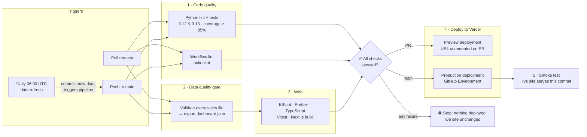

# Sales Pulse

[](https://github.com/siele-tech/test/actions/workflows/pipeline.yml)
[](https://github.com/siele-tech/test/actions/workflows/data-refresh.yml)

**An automated sales analytics platform.** A Python data pipeline validates daily sales files and computes KPIs. A Next.js dashboard presents them. A GitHub Actions CI/CD pipeline tests everything and deploys it to Vercel.

> **Bad data never reaches the dashboard.** If a sales file fails a data-quality check, or any test fails, the pipeline stops before deployment and the live site keeps showing the last good version.

**Live dashboard:** _add your Vercel URL here_

---

## The CI/CD pipeline



| Stage | Job | What it guarantees |
|---|---|---|
| 1 | **Python lint & tests** (matrix 3.12 / 3.13) | Ruff lint + format, 31 unit tests, coverage ≥ 85% |
| 1 | **Workflow lint** | The workflow files themselves are valid (actionlint) |
| 2 | **Data quality gate** | Every sales file is clean: no negative/typo prices, duplicates, missing values, bad regions or dates. Exports `dashboard.json` as a build artifact. |
| 3 | **Web lint, test & build** | ESLint, Prettier, TypeScript, Vitest, production Next.js build using the validated data |
| ✅ | **All checks passed** | A single required status check for branch protection |
| 4 | **Deploy preview** (PRs) | Unique Vercel URL for every PR, posted as a PR comment |
| 4 | **Deploy production** (main) | Deploys through the `production` GitHub Environment (optional approval gate) |
| 5 | **Smoke test** | The live URL is actually serving the commit that was just deployed |

Also included:
- **Daily data refresh** ([data-refresh.yml](.github/workflows/data-refresh.yml)): adds the newest sales day(s), validates them, commits, and triggers the pipeline.
- **Dependabot**: weekly updates for pip, npm and GitHub Actions. Each update is a PR that goes through the full pipeline.
- **Concurrency control**: outdated PR runs are cancelled, and production deploys are never interrupted.
- **Least-privilege tokens**: `contents: read` by default, with extra permissions granted only to the jobs that need them.

## Architecture

```
sales-pulse-platform/
├── .github/
│   ├── workflows/pipeline.yml       # CI/CD: test → validate → build → deploy → smoke test
│   ├── workflows/data-refresh.yml   # scheduled daily data ingestion
│   ├── dependabot.yml
│   └── pull_request_template.md
├── data-pipeline/                   # Python 3.12 · pandas · pytest · ruff
│   ├── src/sales_pipeline/
│   │   ├── validate.py              # data-quality rules (the gate)
│   │   ├── transform.py             # revenue, KPIs, rankings
│   │   ├── export.py                # dashboard.json data contract
│   │   ├── generate.py              # realistic sample data
│   │   └── cli.py                   # `sales-pipeline validate | export | generate`
│   ├── data/raw/                    # one CSV per day (YYYY-MM-DD.csv)
│   ├── data/samples/                # a deliberately corrupted file for demos
│   └── tests/
├── web/                             # Next.js 16 · React 19 · TypeScript · Recharts · Vitest
│   ├── src/app/                     # dashboard page
│   ├── src/components/              # KPI cards, charts, pipeline status
│   ├── src/lib/                     # formatting + insights (unit tested)
│   └── vercel.json                  # Git auto-deploy off: GitHub Actions owns deployment
└── docs/
    ├── SETUP.md                     # one-time GitHub + Vercel setup
    └── DEMO.md                      # showcase walkthrough
```

**Data contract:** the pipeline writes `web/src/data/dashboard.json` (schema in [web/src/lib/types.ts](web/src/lib/types.ts)). The web app imports it at build time, so the deployed site is fully static and fast. The file is generated in CI and never committed.

## Run it locally

Requires Python 3.11+ and Node 22+.

```bash
# 1. Data pipeline
cd data-pipeline
python -m venv .venv
source .venv/bin/activate          # Windows: .venv\Scripts\activate
pip install -e ".[dev]"
ruff check . && pytest --cov       # lint + tests
sales-pipeline validate            # data-quality gate
sales-pipeline export              # -> ../web/src/data/dashboard.json

# 2. Dashboard
cd ../web
npm ci
npm run lint && npm run typecheck && npm test
npm run dev                        # http://localhost:3000
```

Add a new day of sales: `sales-pipeline generate 2026-09-26`

## Data-quality rules

A file is rejected (and deployment blocked) if it has any of the following:

| Rule | Example caught |
|---|---|
| Required columns present, no missing values | empty `customer_id` |
| `unit_price` > 0 and ≤ $5,000 | a refund keyed as `-59.99`; a typo `14900` |
| `quantity` is a whole number ≥ 1 | `0`, `1.5` |
| `region` is North/South/East/West | `Nort` |
| `order_date` is valid and matches the file name | `25/09/2026`; an order from yesterday in today's file |
| `order_id` is unique, within a file and across files | the same day uploaded twice |

Failures show the exact CSV line numbers as annotations on the GitHub Actions run page.

## Setup and demo

- **First-time setup** (GitHub secrets, Vercel project, environments): [docs/SETUP.md](docs/SETUP.md)
- **Showcase walkthrough**: [docs/DEMO.md](docs/DEMO.md)
